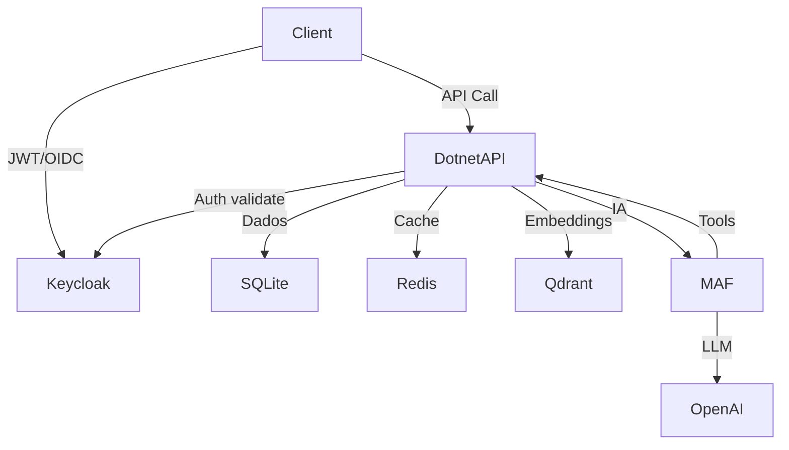

# 🚀 Jornada .NET + IA — 70 Desafios Progressivos

> **Stack:** .NET 8 · Keycloak · Microsoft Agent Framework (MAF) · Qdrant · Redis · Docker  
> **Duração:** ~6 meses

## 📊 Progresso Geral

| Fase | Desafios | Status |
|------|----------|--------|
| Fase 1 — Fundação + IA Basics | 1-20 | 🔵 Em andamento |
| Fase 2 — Intermediário + RAG | 21-40 | ⬜ Não iniciado |
| Fase 3 — Avançado + MAF Agents | 41-55 | ⬜ Não iniciado |
| Fase 4 — Enterprise + DevOps | 56-70 | ⬜ Não iniciado |

---

### Fase 1 — Fundação
- [X] Desafio 01 — Setup + Health Check
- [X] Desafio 02 — CRUD em Memória
- [ ] Desafio 03 — EF Core + SQLite
- [ ] Desafio 04 — FluentValidation
- [ ] Desafio 05 — JWT + ASP.NET Identity
- [ ] Desafio 06 — Keycloak Setup + OIDC
- [ ] Desafio 07 — Authorization Avançada com Keycloak
- [ ] Desafio 08 — Primeiro LLM com Microsoft.Extensions.AI
- [ ] Desafio 09 — Relacionamentos EF Core
- [ ] Desafio 10 — Upload de Arquivo
- [ ] Desafio 11 — Paginação + Filtros
- [ ] Desafio 12 — Middleware + Error Handling
- [ ] Desafio 13 — Análise de Dados com IA
- [ ] Desafio 14 — Classificação com LLM
- [ ] Desafio 15 — Chat Multi-Turn + Memória
- [ ] Desafio 16 — Streaming de Respostas LLM
- [ ] Desafio 17 — Extração Estruturada com LLM
- [ ] Desafio 18 — Repository Pattern + DI
- [ ] Desafio 19 — Validação Fiscal com IA
- [ ] Desafio 20 — Testes Unitários + Serilog

### Fase 2 — Intermediário + RAG
- [ ] Desafio 21 — MemoryCache
- [ ] Desafio 22 — Redis Distribuído
- [ ] Desafio 23 — Rate Limiting
- [ ] Desafio 24 — RAG Básico com Embeddings
- [ ] Desafio 25 — Qdrant Setup
- [ ] Desafio 26 — Semantic Search
- [ ] Desafio 27 — RAG Q&A sobre Documentos
- [ ] Desafio 28 — Chat RAG em Produção
- [ ] Desafio 29 — Document Chunking
- [ ] Desafio 30 — Hybrid Search
- [ ] Desafio 31 — Structured Outputs + Prompt Engineering
- [ ] Desafio 32 — CQRS com MediatR
- [ ] Desafio 33 — Specification Pattern
- [ ] Desafio 34 — Testes de Integração
- [ ] Desafio 35 — Migrations + Versionamento
- [ ] Desafio 36 — Soft Delete + Auditoria
- [ ] Desafio 37 — Unit of Work
- [ ] Desafio 38 — Bulk Operations
- [ ] Desafio 39 — Health Checks
- [ ] Desafio 40 — Webhook System

### Fase 3 — MAF Agents + Workflows
- [ ] Desafio 41 — Primeiro Agent com MAF
- [ ] Desafio 42 — Agent com Memória Multi-Turn
- [ ] Desafio 43 — Multi-Step Agent + Chain of Thought
- [ ] Desafio 44 — Validação Automática com Agent
- [ ] Desafio 45 — MAF Workflows Sequencial
- [ ] Desafio 46 — MAF Workflows Fan-Out/Fan-In
- [ ] Desafio 47 — Detecção de Fraude com Agent
- [ ] Desafio 48 — Agent com Feedback Loop
- [ ] Desafio 49 — OCR + Vision com Agent
- [ ] Desafio 50 — Automação de Relatórios
- [ ] Desafio 51 — Previsão com Agent
- [ ] Desafio 52 — Simulação de Cenários
- [ ] Desafio 53 — MAF + MCP
- [ ] Desafio 54 — Human-in-the-Loop
- [ ] Desafio 55 — Monitoramento Inteligente

### Fase 4 — Enterprise + DevOps
- [ ] Desafio 56 — Assistente de Código (RAG)
- [ ] Desafio 57 — Code Review com Agent
- [ ] Desafio 58 — Geração de PDF
- [ ] Desafio 59 — Exportação Excel
- [ ] Desafio 60 — Multi-Tenancy + Keycloak
- [ ] Desafio 61 — Emails Transacionais
- [ ] Desafio 62 — Background Jobs Hangfire
- [ ] Desafio 63 — Circuit Breaker + Polly
- [ ] Desafio 64 — Data Masking + LGPD
- [ ] Desafio 65 — Observabilidade (OpenTelemetry)
- [ ] Desafio 66 — CI/CD com GitHub Actions
- [ ] Desafio 67 — Docker Compose Completo
- [ ] Desafio 68 — Multi-Agent System Final
- [ ] Desafio 69 — Integração ERP + MCP
- [ ] Desafio 70 — Projeto Final em Produção

---

# FASE 1 — FUNDAÇÃO .NET + IA BASICS
### 5-6 semanas · Desafios 1-20

---

## Desafio 01 — Setup + Health Check
`⏱ 1-2h` `📦 .NET 8, Minimal APIs, Swagger`

**Objetivo:** Primeiro projeto .NET rodando, ambiente configurado.

**Especificação:**
- Criar projeto com `dotnet new webapi -minimal`
- Instalar Swashbuckle (Swagger)
- Endpoint `GET /api/saude` → `{ "status": "OK", "versao": "1.0", "timestamp": "..." }`
- Testar via Swagger UI
- Configurar `launchSettings.json` com porta fixa (5001)

**✅ Definition of Done:**
- [ ] `dotnet run` sobe sem erros
- [ ] Swagger abre em `https://localhost:5001/swagger`
- [ ] Endpoint retorna JSON correto com timestamp real
- [ ] Código no GitHub com README explicando como rodar

**💡 Dica Prática:**
Use `dotnet watch run` durante desenvolvimento — recompila automaticamente ao salvar o arquivo.

**⚠️ Armadilha Comum:**
Não confunda `WebApplication.CreateBuilder` (Minimal APIs) com o `Startup.cs` antigo. No .NET 8 tudo fica no `Program.cs`. Se achar tutoriais com `Startup.cs`, são de versões antigas.

---

## Desafio 02 — CRUD em Memória
`⏱ 2-3h` `📦 Minimal APIs, Data Annotations`

**Objetivo:** Entender os HTTP verbs e como o ASP.NET Core faz binding de request/response.

**Especificação:**
- Modelo: `Produto` (Id, Nome, Preco, Estoque, CriadoEm)
- Armazenamento: `static List<Produto>` (temporário)
- Endpoints:
  - `GET /api/produtos` → lista todos
  - `GET /api/produtos/{id}` → retorna um ou 404
  - `POST /api/produtos` → cria e retorna 201 com Location header
  - `PUT /api/produtos/{id}` → atualiza ou 404
  - `DELETE /api/produtos/{id}` → remove ou 404
- Validação básica: nome obrigatório, preço > 0

**✅ Definition of Done:**
- [ ] Todos os 5 endpoints funcionando via Swagger
- [ ] Status codes corretos (200, 201, 204, 400, 404)
- [ ] POST retorna header `Location: /api/produtos/{id}`
- [ ] Validação recusa produto sem nome ou preço negativo

**💡 Dica Prática:**
Teste os status codes com atenção. Muitos devs retornam 200 em tudo. No .NET:
```csharp
return Results.Created($"/api/produtos/{produto.Id}", produto); // 201
return Results.NotFound();                                       // 404
return Results.NoContent();                                      // 204 no DELETE
```

**⚠️ Armadilha Comum:**
`static List<Produto>` se perde ao reiniciar a aplicação — isso é intencional aqui. O próximo desafio resolve com banco real.

---

## Desafio 03 — EF Core + SQLite
`⏱ 2-3h` `📦 EF Core 8, SQLite, Fluent API`

**Objetivo:** Persistência real. Mesmo CRUD do desafio 2, agora com banco de dados.

**Especificação:**
- Criar `AppDbContext : DbContext`
- Registrar no DI: `builder.Services.AddDbContext<AppDbContext>(...)`
- Migration "Initial" criada e aplicada
- Configurações via Fluent API (não Data Annotations no modelo):
  - Nome: obrigatório, max 100 chars
  - Preço: precisão (18,2)
  - Nome: índice único
- Validações do desafio 2 mantidas

**✅ Definition of Done:**
- [ ] `dotnet ef migrations add Initial` cria migration sem erros
- [ ] `dotnet ef database update` cria o banco
- [ ] Dados persistem após reiniciar a aplicação
- [ ] Índice único de nome rejeita duplicatas com mensagem clara

**💡 Dica Prática:**
Crie um `DatabaseSeeder` para popular dados de teste ao iniciar:
```csharp
// Program.cs
using var scope = app.Services.CreateScope();
var db = scope.ServiceProvider.GetRequiredService<AppDbContext>();
db.Database.Migrate(); // aplica migrations pendentes automaticamente
```

**⚠️ Armadilha Comum:**
Não misture Fluent API com Data Annotations no mesmo modelo. Escolha um e seja consistente. Fluent API é preferida em projetos profissionais porque mantém o modelo limpo.

**🔧 Comandos essenciais EF Core:**
```bash
dotnet add package Microsoft.EntityFrameworkCore.Sqlite
dotnet add package Microsoft.EntityFrameworkCore.Design
dotnet ef migrations add NomeDaMigration
dotnet ef database update
dotnet ef migrations remove   # desfaz última migration
dotnet ef database drop       # zera o banco (dev)
```

---

## Desafio 04 — FluentValidation
`⏱ 2-3h` `📦 FluentValidation, Custom Rules`

**Objetivo:** Validações complexas, reutilizáveis e com mensagens de erro profissionais.

**Especificação:**
- Criar `ProdutoValidator : AbstractValidator<Produto>`
- Regras:
  - Nome: obrigatório, 5-100 chars, sem caracteres especiais
  - Preço: entre R$0,01 e R$999.999,99
  - Estoque: entre 0 e 10.000
  - CNPJ do fornecedor (se preenchido): válido (algoritmo de validação)
- Retornar **todos** os erros de uma vez (não só o primeiro)
- Integrar no pipeline do ASP.NET Core (não validar manualmente)

**✅ Definition of Done:**
- [ ] POST com dados inválidos retorna 400 com lista de todos os erros
- [ ] Mensagens de erro em português e claras
- [ ] Validação de CNPJ funciona com algoritmo real (não só regex)
- [ ] Validator registrado no DI e chamado automaticamente

**💡 Dica Prática:**
```csharp
// Registrar no DI de forma automática (todos os validators do assembly)
builder.Services.AddValidatorsFromAssemblyContaining<ProdutoValidator>();
```

**⚠️ Armadilha Comum:**
FluentValidation não se integra automaticamente ao pipeline do Minimal APIs como faz no MVC. Você precisa injetar e chamar explicitamente, ou usar um filtro customizado.

---

## Desafio 05 — JWT + ASP.NET Identity
`⏱ 3-4h` `📦 ASP.NET Identity, JWT Bearer`

**Objetivo:** Autenticação simples para projetos pequenos (tornearia, sistema interno pequeno). Entender JWT por dentro antes de usar um identity server.

**Quando usar este approach:**
- Sistema com poucos usuários (< 50)
- Aplicação single-tenant
- Não precisa de SSO, social login ou integração com outros sistemas
- Ex: sistema do cunhado, sistema interno simples

**Especificação:**
- ASP.NET Core Identity com EF Core (tabela de usuários no próprio banco)
- Endpoint `POST /api/auth/register` → cria usuário
- Endpoint `POST /api/auth/login` → retorna JWT (1h de expiração)
- Endpoint `GET /api/auth/me` → retorna dados do usuário logado (requer token)
- Roles: Admin, User
- Proteger endpoints de produtos com `[Authorize]`

**✅ Definition of Done:**
- [ ] Register cria usuário com senha hasheada (nunca salvar senha em plain text)
- [ ] Login retorna JWT válido com claims (userId, email, role)
- [ ] Token expirado retorna 401
- [ ] Endpoint com `[Authorize(Roles = "Admin")]` recusa usuário comum (403)
- [ ] Swagger tem campo para inserir Bearer token

**💡 Dica Prática:**
O JWT tem 3 partes separadas por `.` (header.payload.signature). Cole o token no site `jwt.io` para inspecionar o payload e entender o que está dentro.

**⚠️ Armadilha Comum:**
Nunca guarde a `JwtSecretKey` no código. Use `appsettings.json` (em dev) e variável de ambiente (em produção). Uma chave fraca ou exposta é brecha de segurança real.

---

## Desafio 06 — Keycloak Setup + OIDC
`⏱ 3-4h` `📦 Keycloak (Docker), JwtBearer, OIDC`

**Objetivo:** Identity server real. O que sua equipe .NET usa. Aprenda a diferença entre gerar JWT você mesmo (desafio 5) e delegar isso a um servidor dedicado.

**Quando usar Keycloak:**
- Sistema multi-tenant
- Múltiplos serviços que precisam de SSO
- Precisa de social login (Google, Microsoft)
- Empresa já tem Keycloak rodando (seu caso!)

**Especificação:**
- Subir Keycloak com Docker:
  ```yaml
  # docker-compose.yml
  keycloak:
    image: quay.io/keycloak/keycloak:latest
    command: start-dev
    environment:
      KEYCLOAK_ADMIN: admin
      KEYCLOAK_ADMIN_PASSWORD: admin
    ports:
      - "8080:8080"
  ```
- No Keycloak Admin Console:
  - Criar realm `minha-app`
  - Criar client `api` (confidential)
  - Criar usuários: `admin@email.com` (role Admin) e `user@email.com` (role User)
- Na API .NET:
  - Substituir JWT manual pelo JwtBearer que valida tokens do Keycloak
  - Mesmos endpoints protegidos do desafio 5 continuam funcionando
  - Swagger com botão "Authorize" abrindo tela de login do Keycloak

**✅ Definition of Done:**
- [ ] `docker compose up` sobe Keycloak em `http://localhost:8080`
- [ ] Login no Keycloak Admin Console funciona
- [ ] Obter token via Postman (POST para o endpoint de token do Keycloak)
- [ ] API valida o token do Keycloak corretamente
- [ ] Credenciais nunca estão hardcoded (usar `appsettings.json`)

**💡 Dica Prática:**
A URL do discovery document do Keycloak é:
`http://localhost:8080/realms/{realm}/.well-known/openid-configuration`
O ASP.NET Core usa essa URL para descobrir automaticamente como validar os tokens.

**⚠️ Armadilha Comum:**
Keycloak coloca as roles em um lugar diferente do que o ASP.NET Core espera no JWT. Você vai precisar de um `ClaimsTransformation` para mapear `realm_access.roles` para as claims padrão do .NET.

---

## Desafio 07 — Authorization Avançada com Keycloak
`⏱ 2-3h` `📦 Keycloak roles, Authorization Policies`

**Objetivo:** Controle de acesso granular usando roles e policies do Keycloak.

**Especificação:**
- Policy `PodeEditar`: precisa de role `Editor` ou `Admin`
- Policy `SomenteAdmin`: apenas role `Admin`
- Endpoint `DELETE /api/produtos/{id}` → apenas Admin
- Endpoint `POST /api/produtos` → Editor ou Admin
- Endpoint `GET /api/produtos` → qualquer autenticado
- Testar todos os cenários (401, 403, 200)

**✅ Definition of Done:**
- [ ] 401 para request sem token
- [ ] 403 para token válido mas sem permissão
- [ ] 200 para token válido com permissão correta
- [ ] Policies definidas em código (não hardcoded nos endpoints)

---

## Desafio 08 — Primeiro LLM com Microsoft.Extensions.AI
`⏱ 2-3h` `📦 Microsoft.Extensions.AI, IChatClient, IMemoryCache`

**Objetivo:** Primeira integração real com IA — usando a abstração oficial da Microsoft.

**Por que Microsoft.Extensions.AI e não chamar a OpenAI diretamente:**
- `IChatClient` funciona com qualquer provider (OpenAI, Azure OpenAI, Anthropic, Ollama local)
- Troca de provider = mudar uma linha no `Program.cs`
- É a base sobre a qual o MAF (desafios 41+) é construído
- É o "padrão oficial" do ecossistema .NET

**Especificação:**
- Instalar `Microsoft.Extensions.AI.OpenAI` (ou Azure OpenAI)
- Registrar `IChatClient` no DI
- Endpoint `POST /api/ia/analisar-produto`:
  - Input: `{ "nome": "Parafuso M6", "descricao": "parafuso de aço inox" }`
  - LLM retorna: resumo, categorias sugeridas, score de comercialização (0-10)
- Cache de 24h para mesma entrada (evitar custo repetido)
- Timeout de 30 segundos

**Exemplo de response:**
```json
{
  "resumo": "Parafuso de fixação industrial em aço inox",
  "categorias": ["fixadores", "metalurgia", "construção"],
  "score": 7.2,
  "tempo_ms": 1450,
  "origem": "cache"
}
```

**✅ Definition of Done:**
- [ ] API key em variável de ambiente (nunca no código)
- [ ] Timeout de 30s tratado com mensagem clara
- [ ] Segunda chamada com mesmo input retorna do cache (campo `origem: "cache"`)
- [ ] Erro da API de IA não derruba a aplicação (tratamento de exceção)

**💡 Dica Prática:**
Para desenvolvimento, use Ollama com um modelo local (gratuito) e configure o `IChatClient` para apontar para `http://localhost:11434`. Quando estiver pronto para produção, mude para OpenAI ou Azure OpenAI — o código da aplicação não muda nada.

**⚠️ Armadilha Comum:**
Não exponha a API key nem nos logs. Use `ILogger` mas nunca logue o conteúdo da requisição se ela puder conter a chave.

**🔧 Packages:**
```bash
dotnet add package Microsoft.Extensions.AI
dotnet add package Microsoft.Extensions.AI.OpenAI
# ou para Azure:
dotnet add package Microsoft.Extensions.AI.AzureAIInference
```

---

## Desafio 09 — Relacionamentos EF Core + Queries Complexas
`⏱ 3h` `📦 EF Core relationships, LINQ avançado`

**Objetivo:** Modelar dados do mundo real com múltiplas tabelas.

**Especificação:**
- Tabelas: `Produto`, `Categoria`, `Fornecedor`
- Relacionamentos:
  - Produto pertence a 1 Categoria (muitos para um)
  - Produto pertence a 1 Fornecedor (muitos para um)
  - Categoria tem muitos Produtos
- Queries:
  - `GET /api/produtos` → inclui nome da categoria e do fornecedor
  - `GET /api/categorias/{id}/produtos` → todos os produtos de uma categoria
  - `GET /api/relatorio/resumo` → total por categoria, média de preço, produto mais caro

**✅ Definition of Done:**
- [ ] GET /api/produtos não faz N+1 queries (usar Include corretamente)
- [ ] Relatório usa LINQ puro (não traz tudo para memória antes de agregar)
- [ ] Migration nova sem derrubar a antiga

**💡 Dica Prática:**
Para ver as queries SQL que o EF Core está gerando, adicione no `DbContext`:
```csharp
optionsBuilder.LogTo(Console.WriteLine, LogLevel.Information)
              .EnableSensitiveDataLogging(); // apenas em dev!
```
Isso revela problemas de N+1 antes que virem problema em produção.

---

## Desafio 10 — Upload de Arquivo
`⏱ 2-3h` `📦 IFormFile, System.IO`

**Objetivo:** Receber, validar e armazenar arquivos na API.

**Especificação:**
- `POST /api/documentos/upload`
  - Aceitar apenas XML e JSON
  - Tamanho máximo: 10MB
  - Salvar em `wwwroot/uploads/{guid}/{nome-original}`
  - Retornar: `{ "id": "guid", "nome": "arquivo.xml", "tamanho": 2048, "url": "..." }`
- `GET /api/documentos/{id}/download` → retorna o arquivo
- `GET /api/documentos` → lista documentos do usuário autenticado

**✅ Definition of Done:**
- [ ] Arquivo inválido (ex: .exe) retorna 400 com mensagem clara
- [ ] Arquivo > 10MB retorna 400
- [ ] Download retorna o arquivo com Content-Type correto
- [ ] GUID impede colisão de nomes

---

## Desafio 11 — Paginação + Filtros
`⏱ 2-3h` `📦 LINQ, IQueryable`

**Objetivo:** APIs que funcionam com grandes volumes de dados.

**Especificação:**
- `GET /api/produtos?pagina=1&tamanho=10&nome=parafuso&categoriaId=2&precoMin=10&precoMax=100`
- Validações: tamanho entre 1-100, pagina >= 1
- Response:
  ```json
  {
    "dados": [...],
    "total": 245,
    "pagina": 1,
    "tamanho": 10,
    "totalPaginas": 25,
    "temAnterior": false,
    "temProxima": true
  }
  ```

**✅ Definition of Done:**
- [ ] Filtros funcionam em combinação (AND entre eles)
- [ ] `IQueryable` — filtros aplicados no banco, não em memória
- [ ] Página além do total retorna lista vazia (não erro)
- [ ] Sem nenhum filtro → retorna primeira página normalmente

**💡 Dica Prática:**
Crie uma classe genérica `PagedResult<T>` reutilizável e um record `PaginacaoParams` para os parâmetros. Você vai usar paginação em quase todo endpoint de listagem.

---

## Desafio 12 — Middleware + Error Handling Global
`⏱ 2-3h` `📦 Middleware, ILogger, Exception handling`

**Objetivo:** Todo erro da aplicação retorna um response padronizado e é logado.

**Especificação:**
- Middleware que captura qualquer exceção não tratada
- Response padrão:
  ```json
  {
    "code": "VALIDATION_ERROR",
    "message": "Dados inválidos",
    "details": ["Nome é obrigatório", "Preço deve ser maior que zero"],
    "timestamp": "2026-05-10T14:30:00Z",
    "traceId": "abc123"
  }
  ```
- Mapeamento: `ValidationException` → 400, `NotFoundException` → 404, outras → 500
- Nunca expor stack trace em produção

**✅ Definition of Done:**
- [ ] Qualquer exceção não tratada retorna JSON (não HTML de erro padrão)
- [ ] Stack trace aparece apenas quando `ASPNETCORE_ENVIRONMENT=Development`
- [ ] Cada request tem um `traceId` único no log e no response
- [ ] Log de erros 500 inclui contexto (usuário, endpoint, body)

---

## Desafio 13 — Análise de Dados com IA
`⏱ 2-3h` `📦 IChatClient, LINQ`

**Objetivo:** LLM interpreta dados reais do banco em linguagem natural.

**Especificação:**
- `POST /api/ia/insights?periodo=2026-04`
- Pipeline:
  1. Query no banco com LINQ (vendas, produtos, clientes do período)
  2. Montar contexto em texto estruturado
  3. LLM analisa e retorna insights
- Response: lista de insights priorizados com tipo (oportunidade, alerta, informação)

**✅ Definition of Done:**
- [ ] Insights são baseados nos dados reais do banco
- [ ] Sistema prompt define o papel da IA (analista fiscal)
- [ ] Resposta em JSON estruturado (não texto livre)
- [ ] Cache de 1h para o mesmo período

**💡 Dica Prática:**
Seja específico no system prompt:
```
Você é um analista fiscal especializado em NF-e. Analise os dados abaixo e retorne 
exatamente 3-5 insights priorizados. Foque em anomalias e oportunidades de negócio.
```
Quanto mais contexto de domínio você dá, melhor a resposta.

---

## Desafio 14 — Classificação com LLM
`⏱ 2-3h` `📦 IChatClient, JSON mode`

**Objetivo:** LLM como classificador inteligente com confiança.

**Especificação:**
- `POST /api/ia/classificar`
- Input: texto livre descrevendo um item
- LLM classifica em: Produto, Serviço, Material, Imobilizado, Outros
- Retorna: classificação principal, confiança (0-1), alternativas possíveis
- Usar few-shot prompting (3-5 exemplos no prompt)

**✅ Definition of Done:**
- [ ] Response é sempre JSON válido (não texto)
- [ ] Confiança < 0.6 → flag `requerRevisaoHumana: true`
- [ ] Few-shot com exemplos do domínio fiscal

---

## Desafio 15 — Chat Multi-Turn + Memória
`⏱ 2-3h` `📦 IChatClient, EF Core, ChatHistory`

**Objetivo:** Conversa que mantém contexto entre mensagens.

**Especificação:**
- `POST /api/ia/chat` com `{ "sessaoId": "abc", "mensagem": "..." }`
- Histórico persistido no banco (não em memória)
- LLM recebe histórico completo a cada mensagem
- `GET /api/ia/chat/{sessaoId}` → retorna histórico da conversa
- `DELETE /api/ia/chat/{sessaoId}` → limpa histórico

**✅ Definition of Done:**
- [ ] "E em abril?" funciona após "Quanto vendi em março?" (contexto mantido)
- [ ] Histórico persiste após reiniciar a aplicação
- [ ] Limitar histórico a últimas N mensagens (evitar token overflow)

---

## Desafio 16 — Streaming de Respostas LLM ⭐ NOVO
`⏱ 2-3h` `📦 IChatClient, SSE, CancellationToken`

**Objetivo:** Resposta da IA chega em tempo real — palavra por palavra.

**Por que é essencial:**
Toda aplicação LLM moderna usa streaming. Sem ele, o usuário fica olhando um loading por 10 segundos. Com streaming, vê a resposta sendo construída em tempo real — exatamente como o ChatGPT funciona.

**Especificação:**
- `POST /api/ia/chat-stream` → retorna `Content-Type: text/event-stream`
- Usar `IChatClient.CompleteStreamingAsync`
- Formato SSE:
  ```
  data: {"token": "O"}
  data: {"token": " produto"}
  data: {"token": " foi"}
  data: [DONE]
  ```
- `CancellationToken` → usuário pode cancelar antes de terminar
- Timeout de 60 segundos

**✅ Definition of Done:**
- [ ] curl ou Postman mostra tokens chegando em tempo real
- [ ] Cancelamento (fechar conexão) para o processamento no servidor
- [ ] Erros no meio do stream retornam evento `data: {"erro": "..."}`

**💡 Dica Prática:**
```csharp
app.MapPost("/api/ia/chat-stream", async (HttpContext ctx, IChatClient client, ChatRequest req) =>
{
    ctx.Response.Headers.ContentType = "text/event-stream";
    await foreach (var update in client.CompleteStreamingAsync(req.Mensagem))
    {
        await ctx.Response.WriteAsync($"data: {JsonSerializer.Serialize(update)}\n\n");
        await ctx.Response.Body.FlushAsync();
    }
});
```

---

## Desafio 17 — Extração Estruturada com LLM
`⏱ 2-3h` `📦 IChatClient, JSON Schema, FluentValidation`

**Objetivo:** LLM extrai campos de texto livre para JSON validado.

**Especificação:**
- `POST /api/ia/extrair-nfe`
- Input: texto bruto (transcrição de NF-e, email, recibo)
- LLM extrai: emitente, destinatário, CNPJ, valor total, data, itens
- Validar resultado extraído com FluentValidation
- Campos com baixa confiança → flag `revisar: true`

**✅ Definition of Done:**
- [ ] Output é sempre JSON válido com schema definido
- [ ] CNPJ extraído é validado pelo algoritmo real
- [ ] Confiança por campo (não só por extração inteira)

---

## Desafio 18 — Repository Pattern + DI
`⏱ 2-3h` `📦 IRepository<T>, Dependency Injection`

**Objetivo:** Organizar acesso a dados de forma profissional.

**Especificação:**
- Interface `IRepository<T>` com: `GetByIdAsync`, `GetAllAsync`, `AddAsync`, `UpdateAsync`, `DeleteAsync`
- Implementação `Repository<T>` baseada em EF Core
- Repositórios específicos: `IProdutoRepository` (herda IRepository + métodos específicos)
- Endpoints usam repositório (nunca DbContext diretamente)
- Registrar no DI com Scoped lifetime

**✅ Definition of Done:**
- [ ] Endpoints não têm nenhuma referência a `DbContext`
- [ ] Trocar SQLite por outro banco não muda nada nos endpoints
- [ ] Unit tests mockam `IRepository` (não DbContext)

**⚠️ Armadilha Comum:**
Não exagere no Repository. Evite criar um repositório genérico com 30 métodos que ninguém usa. Comece simples e adicione métodos quando precisar.

---

## Desafio 19 — Validação Fiscal com IA
`⏱ 2-3h` `📦 FluentValidation, IChatClient`

**Objetivo:** Combinar validação tradicional com análise inteligente.

**Especificação:**
- `POST /api/ia/validar-nfe`
- Camada 1 — FluentValidation: campos obrigatórios, formatos, CNPJ válido
- Camada 2 — LLM: detecta anomalias (valor fora do padrão, dados inconsistentes)
- Response combinado: erros de validação + insights da IA
- Resultado final: `APROVADO`, `APROVADO_COM_AVISO`, `REJEITADO`

**✅ Definition of Done:**
- [ ] NF-e inválida (CNPJ errado) rejeitada sem chamar LLM (economiza tokens)
- [ ] NF-e válida mas com valor 10x acima do padrão → `APROVADO_COM_AVISO`
- [ ] Reasoning da IA logado para auditoria

---

## Desafio 20 — Testes Unitários + Serilog
`⏱ 3-4h` `📦 xUnit, Moq, FluentAssertions, Serilog`

**Objetivo:** Fundação de testes e logs profissionais.

**Especificação — Testes:**
- Projeto `Tests/` separado (xUnit)
- Testar: validators (FluentValidation), repository methods (mock), helpers
- Mínimo 20 testes, padrão AAA (Arrange, Act, Assert)
- Cobertura de casos feliz E casos de erro

**Especificação — Serilog:**
- Console com cores em desenvolvimento
- Arquivo rotativo em produção (`logs/app-{date}.txt`)
- Enrichers: timestamp, nível, usuário (do Keycloak), request ID
- Log de cada chamada à IA: prompt, tokens usados, tempo, custo estimado

**✅ Definition of Done:**
- [ ] `dotnet test` roda todos os testes sem falha
- [ ] Cada teste tem um nome descritivo: `CriarProduto_ComNomeVazio_DeveRetornar400`
- [ ] Log de chamada IA inclui tempo de resposta e tokens usados

---

# FASE 2 — INTERMEDIÁRIO + RAG COMPLETO
### 5-6 semanas · Desafios 21-40

---

## Desafio 21 — MemoryCache
`⏱ 2-3h` `📦 IMemoryCache`

**Objetivo:** Cache em processo para dados que não mudam com frequência.

**Especificação:**
- Cachear: queries complexas (5 min), respostas LLM (24h), relatórios (1h)
- Invalidar cache quando dados são alterados
- Endpoint admin `DELETE /api/cache` → limpa tudo
- Log quando cache é hit vs miss

**✅ Definition of Done:**
- [ ] Segunda chamada para mesma query é notavelmente mais rápida
- [ ] Cache invalida quando produto é atualizado
- [ ] Campo `origem: "cache"` no response indica hit

---

## Desafio 22 — Cache Distribuído com Redis
`⏱ 2-3h` `📦 StackExchange.Redis, IDistributedCache, Docker`

**Objetivo:** Cache que persiste entre deploys e funciona com múltiplas instâncias.

**Especificação:**
- Redis via Docker (no `docker-compose.yml`)
- Substituir `IMemoryCache` por `IDistributedCache` nos endpoints críticos
- Serialização com `System.Text.Json`
- TTLs: respostas IA (30 min), relatórios (1 dia), catálogo (12h)

**✅ Definition of Done:**
- [ ] Cache persiste ao reiniciar a aplicação
- [ ] `docker compose up redis` sobe Redis
- [ ] Redis Commander (UI) mostrando as chaves salvas

**💡 Dica Prática:**
Convenção de chave: `{entidade}:{id}:{versao}` — ex: `produto:42:v1`
Facilita invalidação seletiva (ex: invalidar tudo que começa com `produto:42`)

---

## Desafio 23 — Rate Limiting
`⏱ 2-3h` `📦 Rate Limiting middleware, Redis`

**Objetivo:** Proteger a API (e sua carteira de IA) contra abuso.

**Especificação:**
- 100 requests/min por IP (anônimos)
- 1000 requests/hora por usuário autenticado (via Keycloak claim)
- Endpoints de IA: limite mais restrito (10/min — custam tokens)
- Headers no response: `X-RateLimit-Limit`, `X-RateLimit-Remaining`, `X-RateLimit-Reset`
- 429 quando exceder, com `Retry-After` header

**✅ Definition of Done:**
- [ ] 11ª chamada de IA no mesmo minuto retorna 429
- [ ] Headers de rate limit presentes em toda resposta
- [ ] Usuário autenticado tem limite maior que anônimo

---

## Desafio 24 — RAG Básico com Embeddings em Memória
`⏱ 3h` `📦 IEmbeddingGenerator, Cosine Similarity`

**Objetivo:** Entender embeddings na prática antes de usar um vector database.

**Especificação:**
- Usar `IEmbeddingGenerator<string, Embedding<float>>` (Microsoft.Extensions.AI)
- Indexar 10-20 documentos em memória (lista de vetores)
- `POST /api/rag/buscar` → query, retorna top 3 mais similares
- Calcular similaridade de cosseno manualmente
- `POST /api/rag/chat` → pergunta, busca docs relevantes, LLM responde com contexto

**✅ Definition of Done:**
- [ ] "Qual é a alíquota do ICMS?" encontra o documento sobre ICMS
- [ ] Busca por significado (não keyword): "tributo sobre circulação" também encontra
- [ ] LLM responde baseada no documento, não em conhecimento geral

**💡 Dica Prática:**
Embeddings são vetores de ~1536 números. A similaridade de cosseno entre dois vetores mostra o quão semanticamente parecidos são os textos. Um valor acima de 0.8 é muito similar.

---

## Desafio 25 — Qdrant Setup — Vector Database
`⏱ 3 dias` `📦 Qdrant.Client, Docker`

**Objetivo:** Infraestrutura real para RAG em produção.

**Especificação:**
- Qdrant via Docker
- Criar coleção `documentos-fiscais` com dimensão correta (depende do modelo de embedding)
- `POST /api/rag/indexar` → recebe doc, gera embedding, armazena no Qdrant com metadata
- `GET /api/rag/colecao/stats` → tamanho, número de pontos

**✅ Definition of Done:**
- [ ] `docker compose up qdrant` sobe e UI abre em `localhost:6333/dashboard`
- [ ] Documento indexado aparece na UI do Qdrant
- [ ] Metadata (id, nome, data, tipo) salva junto com o vetor

---

## Desafio 26 — Semantic Search com Qdrant
`⏱ 2-3 dias` `📦 Qdrant search API`

**Objetivo:** Busca por significado real, com score e filtros.

**Especificação:**
- `POST /api/rag/buscar`
- Top 5 mais relevantes com score de similaridade
- Filtros de metadata (ex: apenas documentos do tipo "NF-e")
- Threshold: ignorar resultados com score < 0.7
- Response inclui: texto do chunk, metadata, score

---

## Desafio 27 — RAG Q&A sobre Documentos
`⏱ 3 dias` `📦 Qdrant, IChatClient, Prompt Engineering`

**Objetivo:** Pipeline RAG completo com atribuição de fontes.

**Especificação:**
- `POST /api/rag/responder`
- Pipeline: embed query → buscar no Qdrant → montar contexto → LLM → resposta + fontes
- Response inclui: resposta, documentos usados (com trechos), confiança
- LLM deve dizer "Não encontrei informação suficiente" quando contexto é insuficiente

---

## Desafio 28 — Chat RAG em Produção
`⏱ 3 dias`

**Objetivo:** Chat multi-turn com RAG real + streaming.

**Especificação:**
- Chat com histórico (Desafio 15) + RAG (Desafio 27) + Streaming (Desafio 16)
- Cada mensagem: embed → busca → contexto → LLM stream → salva
- `GET /api/rag/chat/{sessaoId}/fontes` → quais docs foram usados em cada resposta

---

## Desafio 29 — Document Chunking Strategy
`⏱ 2-3 dias`

**Objetivo:** Dividir documentos de forma que o RAG funcione bem.

**Especificação:**
- Implementar 3 estratégias de chunking:
  1. **Fixed**: chunks de 500 tokens com 50 de overlap
  2. **Por parágrafo**: divide em parágrafos naturais
  3. **Hierárquico**: capítulo → seção → parágrafo (com metadata de hierarquia)
- Medir: qual estratégia dá respostas mais precisas para NF-e?

---

## Desafio 30 — Hybrid Search
`⏱ 3 dias` `📦 Lucene.NET, Qdrant`

**Objetivo:** Combinar busca por keyword com busca semântica para melhores resultados.

**Especificação:**
- BM25 com Lucene.NET para keyword search
- Reciprocal Rank Fusion para combinar scores
- Score final: 40% BM25 + 60% semântico
- `POST /api/rag/buscar-hibrida`
- Comparar resultados: semântico puro vs híbrido

---

## Desafio 31 — Structured Outputs + Prompt Engineering Avançado ⭐ SUBSTITUIU FINE-TUNING
`⏱ 2-3 dias`

**Objetivo:** Extrair o máximo do LLM sem treinar modelo (o que 90% das empresas faz na prática).

**Por que substituiu Fine-tuning:**
Fine-tuning custa dinheiro real ($$), requer dataset de qualidade e raramente é necessário quando prompts bem feitos + RAG já resolvem. O mercado hoje usa structured outputs e bons prompts.

**Especificação:**
- JSON Schema para garantir formato da resposta
- Chain of Thought: pedir ao modelo para "pensar em voz alta" antes de responder
- Few-shot com 5 exemplos do domínio de NF-e
- System prompt de domínio: "Você é um analista fiscal brasileiro especializado em..."
- Experimento: medir acurácia com prompt básico vs CoT vs few-shot
- Comparativo em tabela: qual técnica ganha em cada tipo de tarefa

**✅ Definition of Done:**
- [ ] Response com JSON Schema nunca quebra o parse
- [ ] CoT melhora acurácia em classificações ambíguas
- [ ] Tabela comparativa documentada no README

---

## Desafios 32-40 — Padrões .NET e Infra

### Desafio 32 — CQRS com MediatR
`⏱ 2-3 dias` `📦 MediatR`
Commands (criar, atualizar, deletar) separados de Queries (buscar, listar). MediatR como mediador. Endpoints externos não mudam.

**✅ Definition of Done:**
- [ ] Nenhum endpoint acessa repositório diretamente (tudo via MediatR)
- [ ] Handler de Command não retorna dados (só sucesso/falha)
- [ ] Handler de Query não tem side effects

### Desafio 33 — Specification Pattern
`⏱ 2-3 dias`
`NFesPorPeriodo`, `NFesComAtraso`, `NFesPorFaixaValor`. Repository aceita Specification. Reutilização real de lógica de busca.

### Desafio 34 — Testes de Integração
`⏱ 3 dias` `📦 WebApplicationFactory, InMemory DB`
Testes end-to-end dos endpoints. Banco em memória. Mock de token Keycloak. Mínimo 25 testes cobrindo fluxos completos.

### Desafio 35 — Migrations + Versionamento
`⏱ 2-3 dias`
5 migrations sequenciais com rollback funcionando. Script SQL gerado e commitado no repositório.

### Desafio 36 — Soft Delete + Auditoria
`⏱ 3 dias` `📦 HasQueryFilter, SaveChanges Interception`
`DeletedAt` com query filters. Tabela `Auditoria` interceptando todo SaveChanges. Usuário do Keycloak registrado em cada mudança.

### Desafio 37 — Unit of Work Pattern
`⏱ 2-3 dias`
`IUnitOfWork` com múltiplos repositórios em uma transação. SaveChanges atômico. Rollback se algo falhar.

### Desafio 38 — Bulk Operations
`⏱ 2-3 dias` `📦 EFCore.BulkExtensions`
Import de até 1000 NF-e em uma requisição. Validar cada uma. Relatório de sucesso/falha por item.

### Desafio 39 — Health Checks
`⏱ 2-3 dias` `📦 Microsoft.Extensions.Diagnostics.HealthChecks`
`GET /health` verifica: DB, Redis, Qdrant, Keycloak, espaço em disco. Status Healthy/Degraded/Unhealthy.

### Desafio 40 — Webhook System
`⏱ 3 dias` `📦 Polly, Background jobs`
Registro de webhooks. Disparo automático em eventos (NF-e criada, etc). Retry com Polly. Log de entrega.

---

# FASE 3 — MAF AGENTS + WORKFLOWS
### 4-5 semanas · Desafios 41-55

---

## Desafio 41 — Primeiro Agent com MAF
`⏱ 3 dias` `📦 Microsoft.Agents.AI`

**Objetivo:** Criar seu primeiro AI Agent real.

**O que é MAF:**
- Successor oficial do Semantic Kernel + AutoGen (mesmas equipes da Microsoft)
- Versão 1.0 lançada em 2026 — APIs estáveis, produção-ready
- `AIAgent` + tools + sessions + workflows + MCP

**Especificação:**
- Instalar `Microsoft.Agents.AI`
- Agent com 3 tools:
  - `buscar_nfe(numero)` → consulta banco
  - `calcular_impostos(valor, tipo)` → cálculo local
  - `validar_cnpj(cnpj)` → validação com algoritmo
- `POST /api/agent/processar` → input em linguagem natural, agent decide quais tools usar

**✅ Definition of Done:**
- [ ] "Qual é o valor total de impostos da NF-e 45678?" → agent busca e calcula
- [ ] Agent usa exatamente as tools necessárias (não todas)
- [ ] Log do reasoning (quais tools foram chamadas e por quê)

**🔧 Packages:**
```bash
dotnet add package Microsoft.Agents.AI
dotnet add package Microsoft.Agents.AI.Foundry  # se usar Azure AI Foundry
```

---

## Desafio 42 — Agent com Memória Multi-Turn
`⏱ 3 dias` `📦 MAF Sessions`

Sessions do MAF para manter contexto. Persistir sessões no banco. Agent lembra contexto entre mensagens da mesma sessão.

---

## Desafio 43 — Multi-Step Agent + Chain of Thought
`⏱ 3 dias`

Agent analisa NF-e em 5 steps sequenciais. Reasoning visível no response. Confiança por step. Recomendação final fundamentada.

---

## Desafio 44 — Validação Automática com Agent
`⏱ 2-3 dias`

8 validações em sequência. Score composto. Resultado: APROVADO / AVISO / REJEITADO com razões.

---

## Desafio 45 — MAF Workflows — Sequencial
`⏱ 3 dias` `📦 Microsoft.Agents.AI.Workflows`

**Objetivo:** Controle explícito sobre o fluxo de execução (diferente de agents livres).

**Diferença agent vs workflow:**
- **Agent**: LLM decide o que fazer (bom para perguntas abertas)
- **Workflow**: você define o grafo de execução (bom para processos definidos e auditáveis)

Workflow "Processar NF-e" com 4 executors encadeados. Error propagation. Log de cada step.

---

## Desafio 46 — MAF Workflows — Fan-Out/Fan-In
`⏱ 3 dias`

3 agents em paralelo (financeiro, fiscal, comercial). Fan-in consolida. Executor final recomenda. Comparar tempo: paralelo vs sequencial.

---

## Desafio 47 — Detecção de Fraude com Agent
`⏱ 3 dias`

Multi-factor scoring. 5 verificações de fraude. Score 0-100. BLOQUEAR / REVISAR / OK. Reasoning auditável.

---

## Desafio 48 — Agent com Feedback Loop
`⏱ 3 dias`

Coletar feedback do usuário. Usar como few-shot em futuras chamadas. Medir melhoria de acurácia ao longo do tempo.

---

## Desafio 49 — OCR + Vision com Agent
`⏱ 3 dias` `📦 Vision API`

Upload de foto de documento. Agent extrai campos com Vision. Confiança por campo. Cria registro no banco.

---

## Desafio 50 — Automação de Relatórios
`⏱ 2-3 dias` `📦 QuestPDF`

Agent consulta banco + analisa + gera PDF profissional automaticamente.

---

## Desafio 51 — Previsão com Agent
`⏱ 2-3 dias`

Análise de 12 meses. Detecção de sazonalidade. Forecast do próximo período. Intervalo de confiança. Tudo via LLM (sem ML.NET).

---

## Desafio 52 — Simulação de Cenários
`⏱ 3 dias`

What-if analysis. "Se aumentar preço 10%?" → agent simula impacto em receita, volume e lucro.

---

## Desafio 53 — MAF + MCP
`⏱ 3 dias` `📦 MAF MCP Client`

**Objetivo:** Conectar agent a ferramentas externas via protocolo padrão.

MCP (Model Context Protocol) é o padrão que a indústria está adotando para tools. MAF tem suporte nativo. Agent descobre e usa tools de serviços externos sem código específico para cada um.

---

## Desafio 54 — Human-in-the-Loop
`⏱ 2-3 dias` `📦 MAF RequestPort`

Workflow pausa para aprovação humana (NF-e > R$50k). Humano aprova/rejeita via endpoint. Workflow continua ou cancela.

---

## Desafio 55 — Monitoramento Inteligente
`⏱ 2-3 dias`

Agent em background job. Detecta anomalias proativamente. Alertas contextualizados. Escalação automática.

---

# FASE 4 — ENTERPRISE + DEVOPS
### 4-5 semanas · Desafios 56-70

---

## Desafios 56-70 — Resumo

| # | Desafio | Tech | Tempo |
|---|---------|------|-------|
| 56 | Assistente de Código (RAG no codebase) | Qdrant, IChatClient | 3 dias |
| 57 | Code Review Automático com Agent | GitHub API, MAF | 3 dias |
| 58 | Geração de PDF (NF-e) | QuestPDF | 2-3 dias |
| 59 | Exportação Excel em escala | ClosedXML, Streaming | 2-3 dias |
| 60 | Multi-Tenancy + Keycloak realms | Keycloak, Query Filters | 3 dias |
| 61 | Emails Transacionais | SendGrid, Hangfire | 2-3 dias |
| 62 | Background Jobs com Hangfire | Hangfire, Dashboard | 3 dias |
| 63 | Circuit Breaker + Polly | Polly, Fallback | 3 dias |
| 64 | Data Masking + LGPD | Encryption, Keycloak roles | 3 dias |
| 65 | Observabilidade (OpenTelemetry) | OTel, Prometheus, Grafana | 3 dias |
| 66 | CI/CD com GitHub Actions | GitHub Actions, Docker | 3 dias |
| 67 | Docker Compose Completo | Docker, Compose | 3 dias |
| 68 | Multi-Agent System Final ⭐ | MAF Workflows | 3 dias |
| 69 | Integração ERP + MCP | MAF, MCP | 3 dias |
| 70 | Projeto Final em Produção 🎓 | Tudo junto | 5 dias |

---

## Desafio 70 — Projeto Final em Produção 🎓
`⏱ 5 dias`

**Objetivo:** Tudo funcionando, testado e documentado como um projeto de portfólio real.

**Entregáveis:**
- [ ] `docker compose up` sobe tudo com um comando (app, banco, Redis, Qdrant, Keycloak)
- [ ] CI/CD rodando no GitHub Actions
- [ ] 100+ testes (unitários + integração) passando no CI
- [ ] README profissional com: o que é, como rodar, arquitetura, tecnologias
- [ ] Diagrama de arquitetura (pode ser feito com Mermaid no README)
- [ ] Collection Postman/Insomnia com todos os endpoints
- [ ] Demo: fluxo completo de uma NF-e do upload até o relatório gerado por IA

**Diagrama no README (Mermaid — renderiza no GitHub):**


---

## Stack Completa

| Categoria | Tecnologia | Desafios |
|-----------|-----------|---------|
| Framework | .NET 8, Minimal APIs | 1-70 |
| ORM | EF Core 8, SQLite→SQL Server | 3-70 |
| Validação | FluentValidation | 4-70 |
| Auth simples | ASP.NET Identity + JWT | 5 |
| Auth enterprise | Keycloak (OIDC, OAuth2) | 6, 7, 60 |
| IA abstraction | Microsoft.Extensions.AI | 8-40 |
| IA agents | Microsoft Agent Framework (MAF) | 41-70 |
| Protocols | MCP (Model Context Protocol) | 53, 69 |
| Vector DB | Qdrant | 25-30 |
| Cache | Redis (IDistributedCache) | 22-70 |
| Patterns | Repository, CQRS, UoW, Specification | 18, 32, 33, 37 |
| Testes | xUnit, Moq, WebApplicationFactory | 20, 34 |
| PDF | QuestPDF | 50, 58 |
| Excel | ClosedXML | 59 |
| Jobs | Hangfire | 62 |
| Resilience | Polly | 63 |
| Observability | OpenTelemetry, Serilog, Grafana | 65 |
| Deploy | Docker Compose, GitHub Actions | 66, 67 |

---

## Timeline

```
Mês 1  → Desafios 01-14  → .NET fundação + Keycloak + IA basics
Mês 2  → Desafios 15-28  → Streaming + RAG + Qdrant
Mês 3  → Desafios 29-42  → Padrões avançados + MAF primeiros agents
Mês 4  → Desafios 43-55  → MAF agents avançados + workflows
Mês 5  → Desafios 56-63  → Enterprise features
Mês 6  → Desafios 64-70  → DevOps + projeto final
```

---

*Jornada iniciada em: ___________*  
*Previsão de conclusão: ___________*  
*Desafios concluídos: 0/70*
